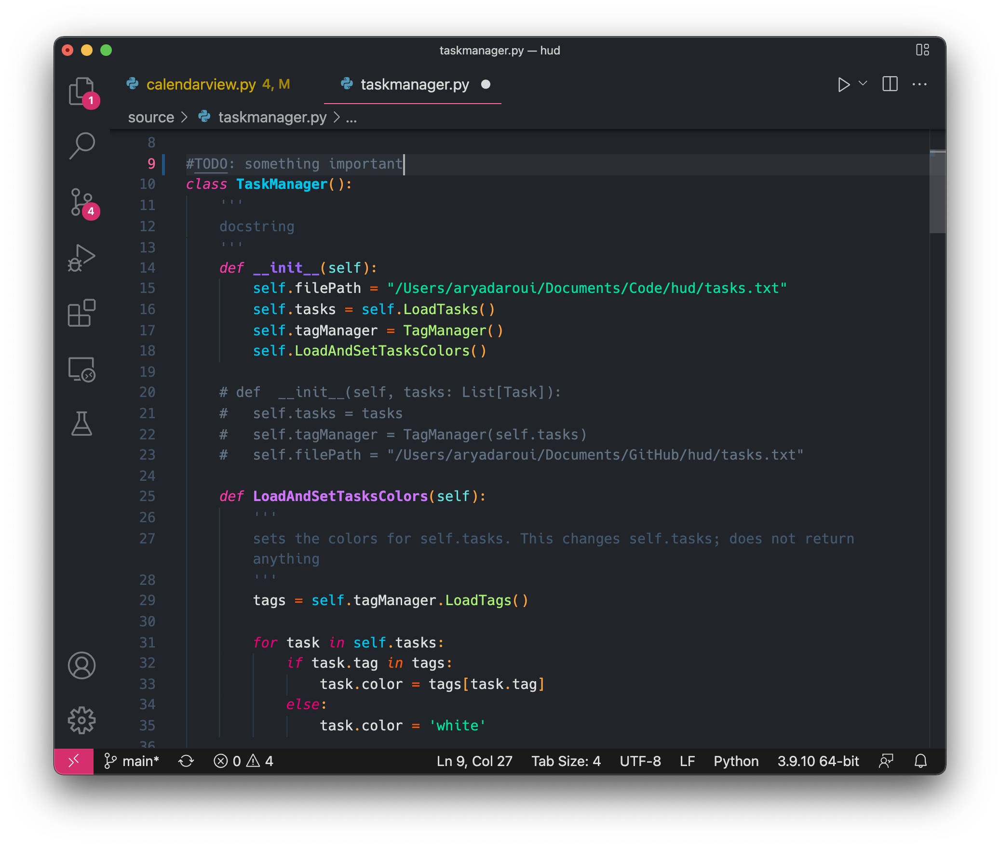
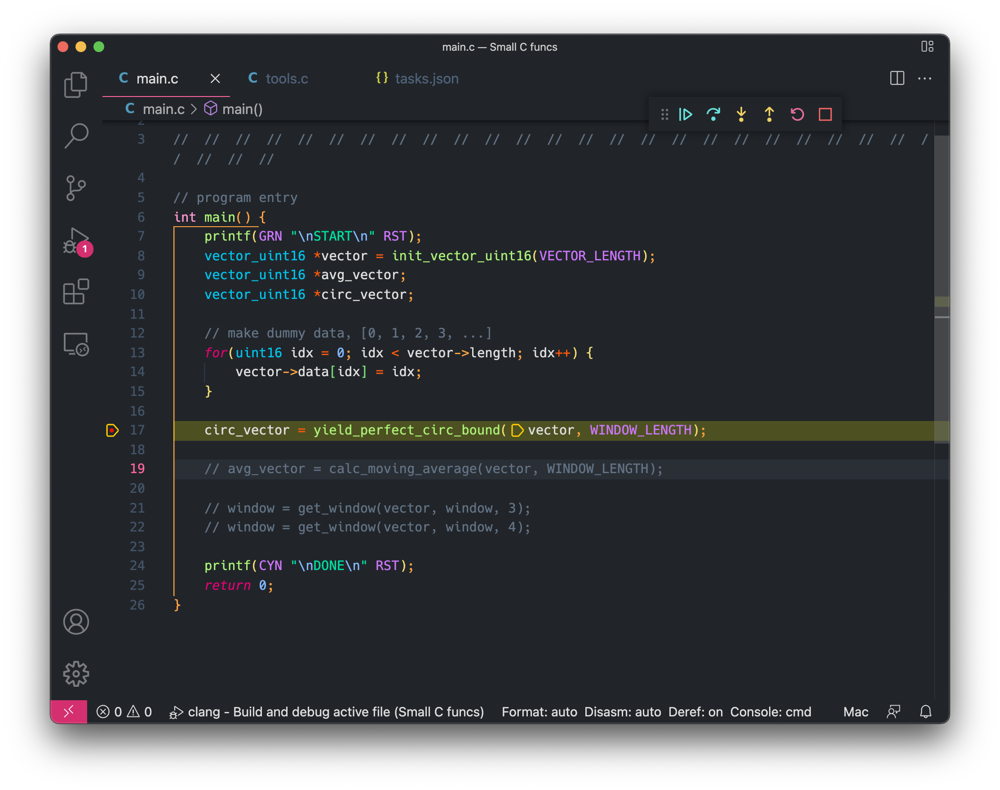

# Bubble

A VS Code theme with the goal of using as many meaningful colors as possible for Python and C syntax highlighting, but works fine for other languages too. Inspired by the colorful iridescence on the thin film of bubbles. A bit more info available [here](https://aryadaroui.github.io/2022/03/29/bubble-dark.html).






The colorful bracket colors are:

```
	"workbench.colorCustomizations": {
		"editorBracketHighlight.foreground1": "#ffa23f",
		"editorBracketHighlight.foreground2": "#edd871",
		"editorBracketHighlight.foreground3": "#75dc6f",
		"editorBracketHighlight.foreground4": "#71e7e7",
		"editorBracketHighlight.foreground5": "#986fe9",
	},
```
