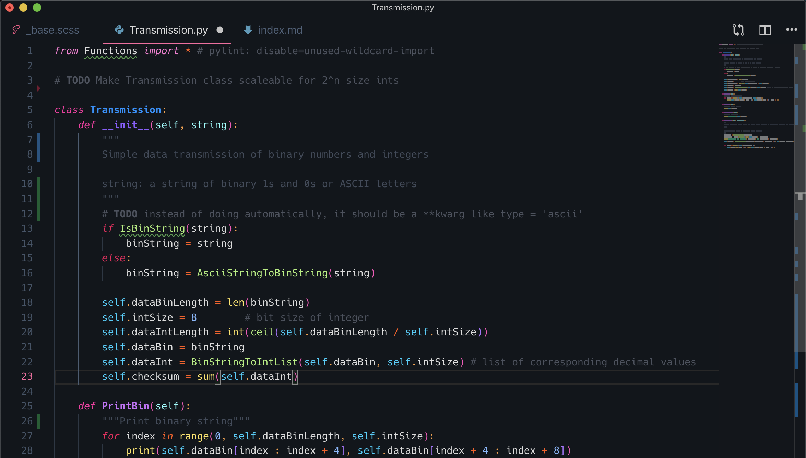
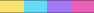

# Bubble

A VS Code theme with the goal of using as many meaningul colors as possible for Python syntax highlighting, but works fine for other languages too. Inspired by the colorful iridiescence on the thin film of bubbles.




The colorful brackets are from [Bracket Pair Colorizer 2](https://marketplace.visualstudio.com/items?itemName=CoenraadS.bracket-pair-colorizer-2), using the settings:

```
	"bracket-pair-colorizer-2.colors": [
		"#FF4DBB",
		"#AE70FF",
		"#00DFFD",
		"#FFE251"
	]
```



